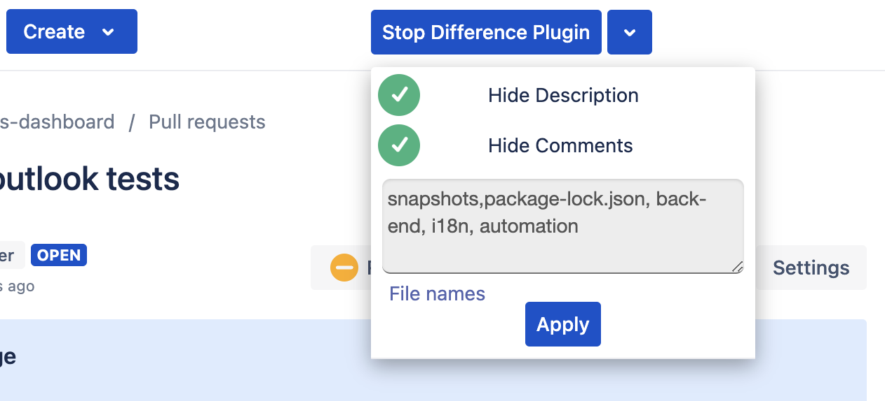

# bitbacket-close-diff-plugin
Plugin wich will close selected diff in repository automaticly
## To use plugin just pull it open extension page and add plugin folder there

* [Firefox extension page](about:debugging#/runtime/this-firefox) : [about:debugging#/runtime/this-firefox](about:debugging#/runtime/this-firefox)

## Usage
```
# clone project or download as zip
# unzip archive
# open Firefox extension page
# press Load unpacked with path where folder with extensio is
# reload youtube page
```



## License

MIT © 2023 Bogdan Pryvalov
